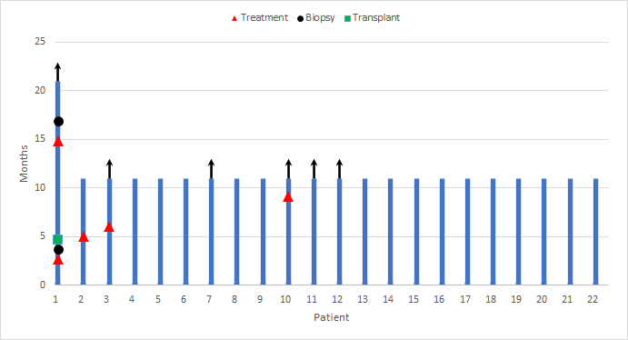
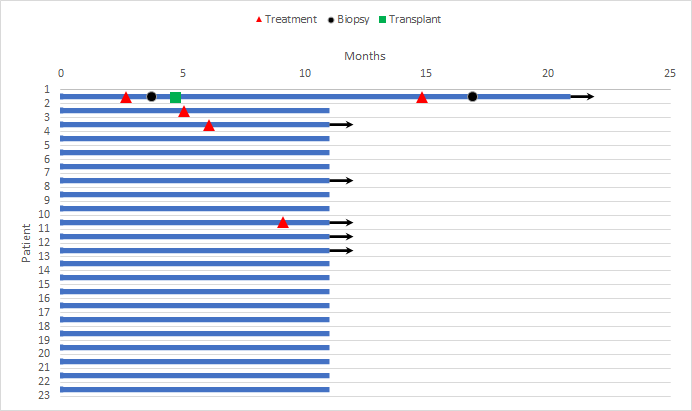
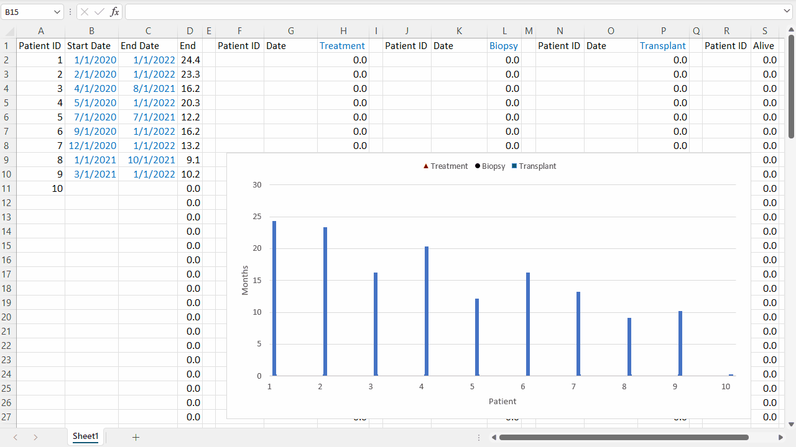
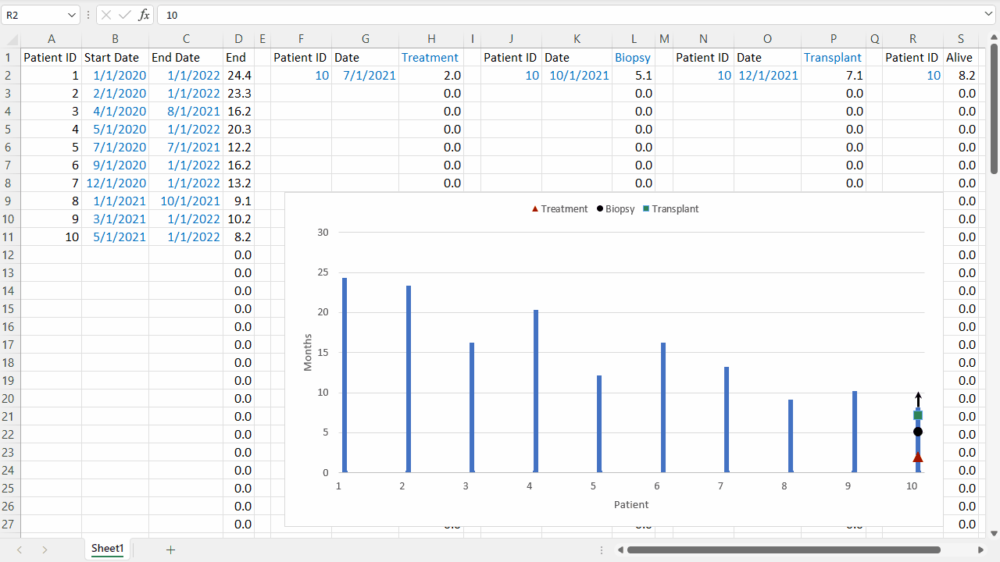

# excel-swimmer

Simple Excel-based swimmer plots to illustrate patient stories.

[Direct Download](https://github.com/ptgrogan/excel-swimmer/blob/master/swimmer.xlsx?raw=true)

## Examples

## Overview

This repository contains a simple Excel spreadsheet for creating swimmer plots to illustrate patient stories. It does not require or depend on any other software to use. Edit any of the cells with blue text to customize the swimmer plots which are available in both horizontal and vertical orientations.

The default configuration allows for up to 100 data items in five categories:
 * Patient Information -- sets the bounds for a swim lane bar (ID, History Start Date, History End Date)
 * "Treatment" Event -- adds a red triangle to the swim lane (Patient ID and Date)
 * "Biopsy" Event -- adds a black circle to the swim lane (requires Patient ID and Date)
 * "Transplant" Event -- adds a green square to the swim lane (requires Patient ID and Date)
 * "Alive" Indicator -- adds an arrow to the end of a swim lane (requires Patient ID)

### Adding Patient Data

Edit any of the cells with blue text to add patient data.

### Changing the Number of Patients

If you add or remove patients, adjust the chart axis limits to ensure all are visible (left click to select patient axis, right click and select "Format Axis..."). You may want to set the lower bound slightly less than 1 (default: 0.9) to avoid cutting off part of the plot.

### Changing the Types of Events

If you add or more events, edit the chart series (right click, select "Select data...", click "Add" or "Remove", similar to existing event series).

## Contact

Paul T. Grogan <pgrogan@stevens.edu>
